# Físicas - Tilemap - Platforming
## Juan Guillermo Zafra Fernández

### Físicas 2D

Para empezar se crea una escena. En esta se ponen dos círculos sin nada añadido.

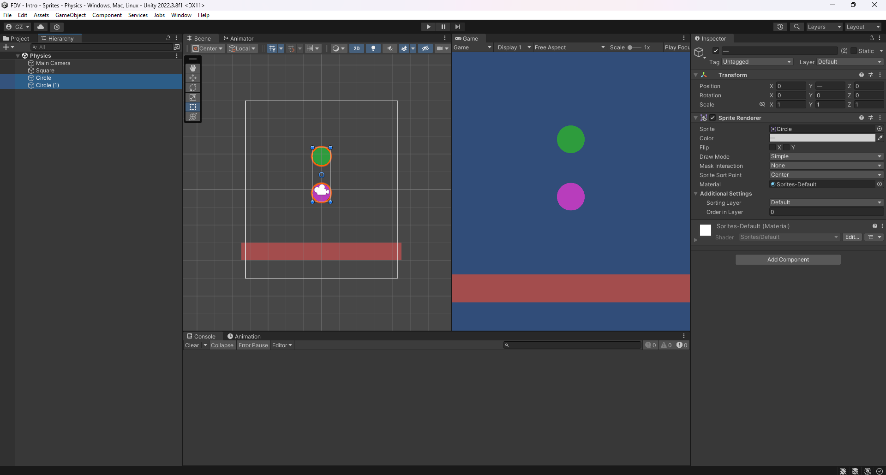

La ejecución es como sigue 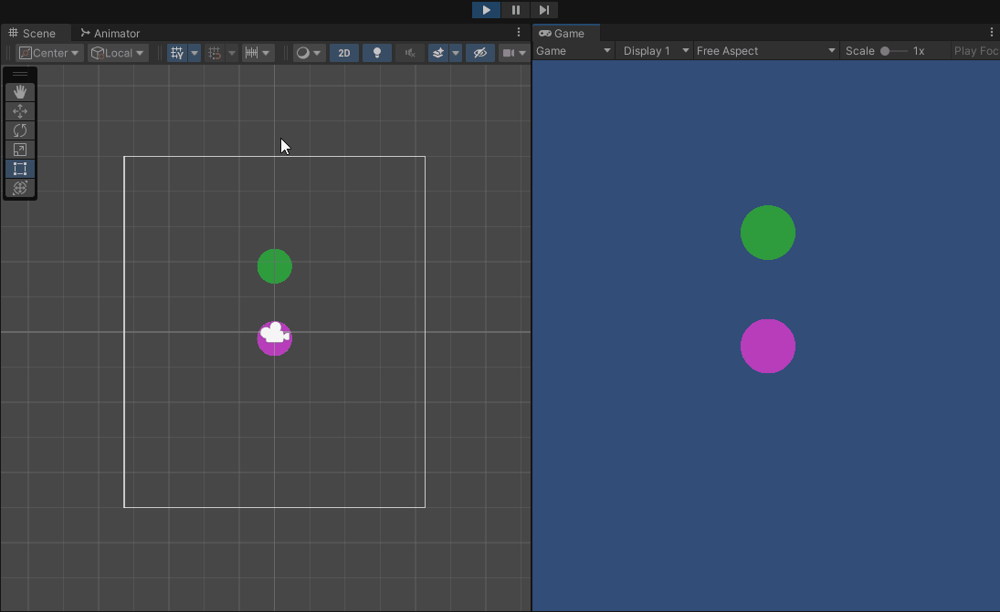

Ningún script funciona en este caso debido a que no colisionan con nada.

Luego añadimos a un objeto físicas, añadiéndole un `Rigidbody2D` y `CircleCollider2D`.

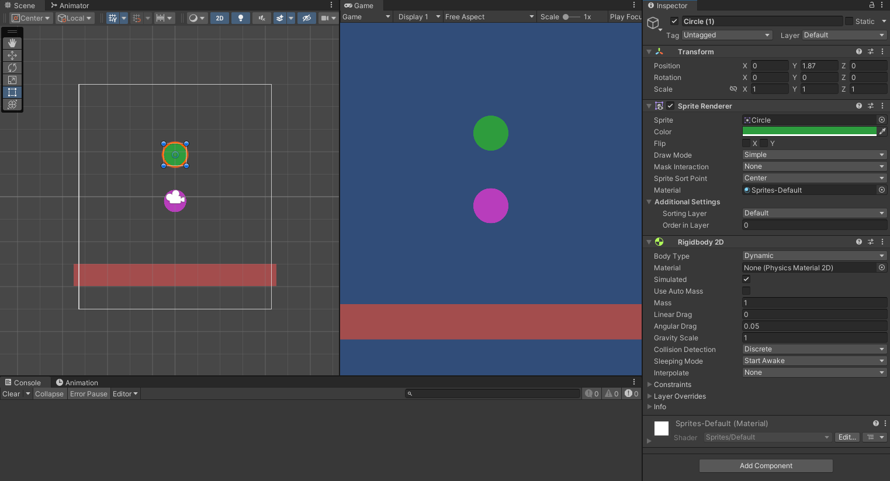

La ejecución es como sigue.

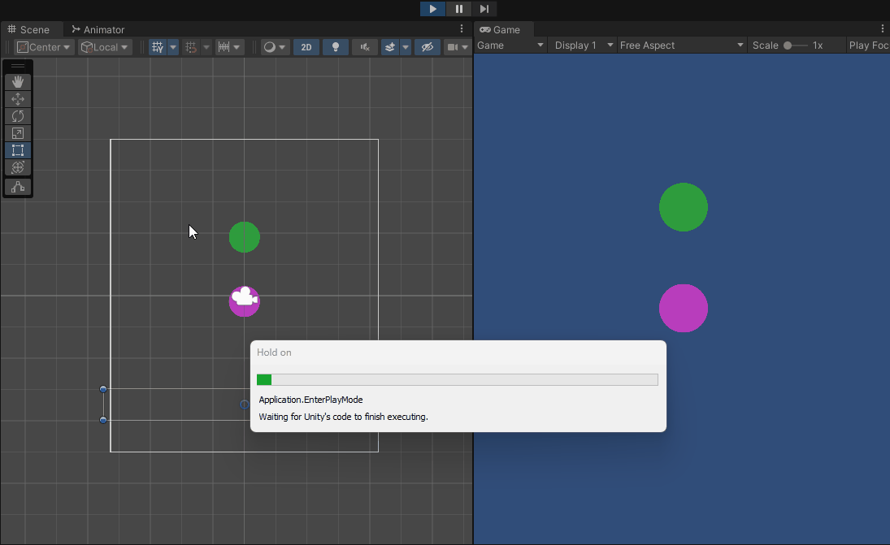

Luego añadimos al otro físicas de la misma forma.

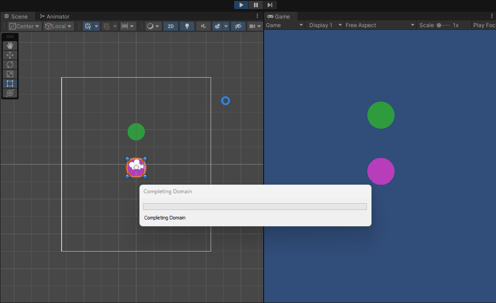

Añadimos a uno masa hasta que sea 10 de masa. Se puede observar que se desplaza algo más rápido (a pesar de que en la vida real no funcione así).

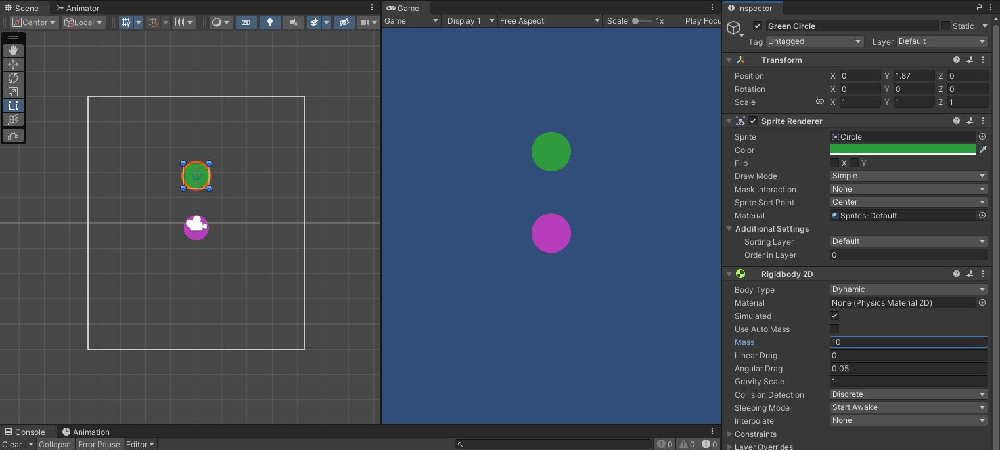

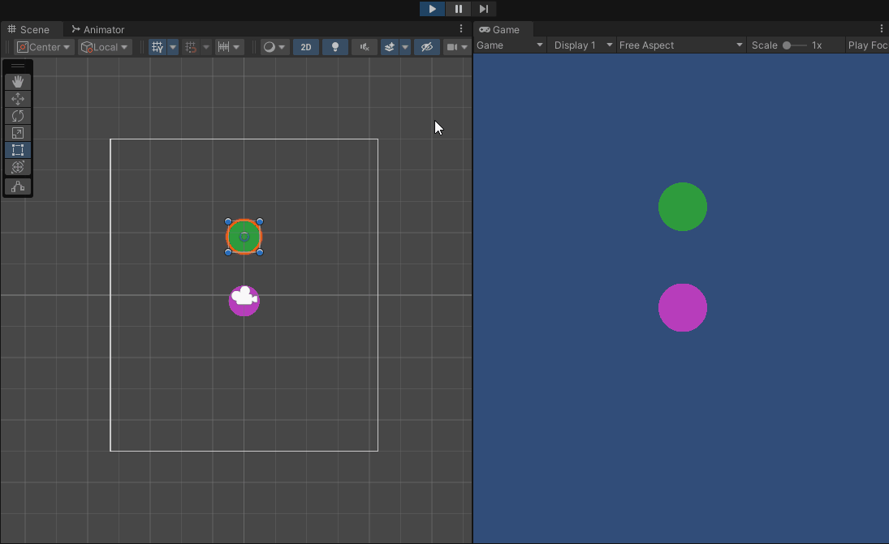

Se hace que uno sea `trigger` presionando sobre la selección en el `Rigidbody 2D`.

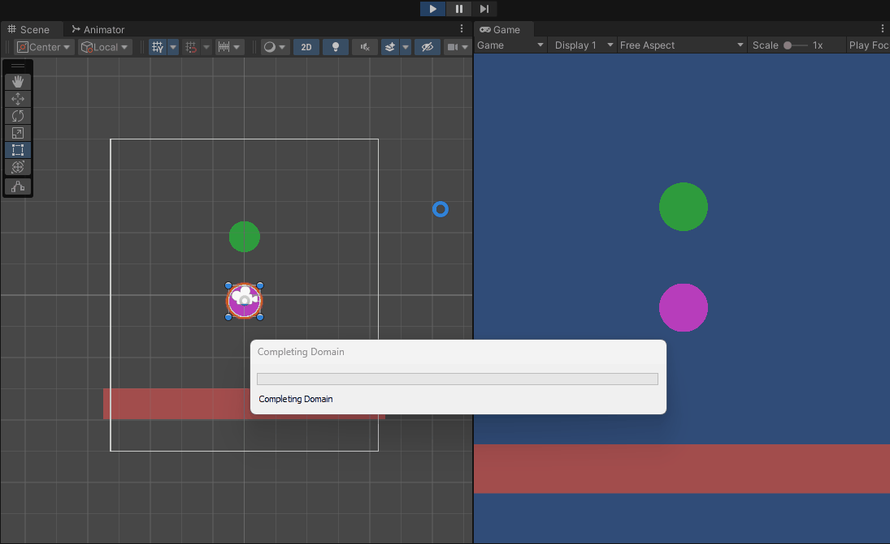

En este caso se dispara un mensaje al chocar el círculo verde con el rectángulo y al dispararse el círculo magenta con el rectángulo. Al ser `trigger` el magenta, atraviesa el rectángulo.

Para el último ejercicio de la sección se hace un objeto cinemático.

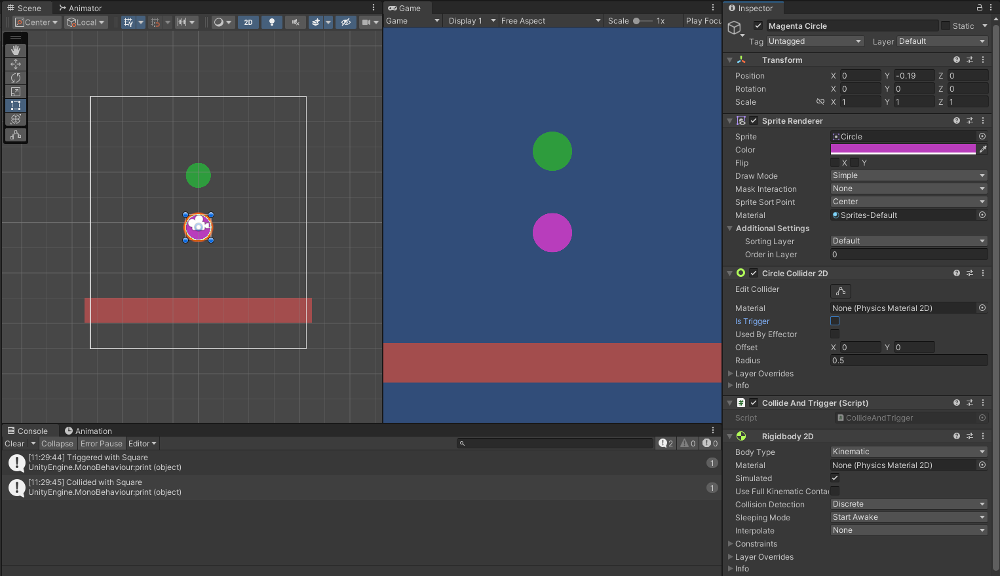

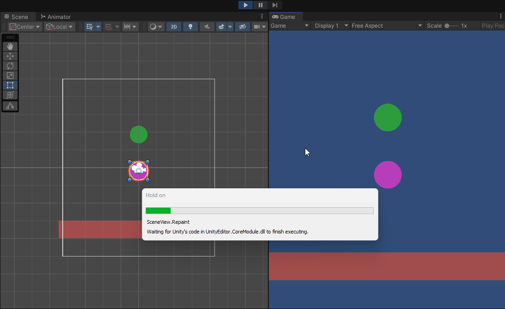

Cuando los círculos se mueven están en modo dinámico. En este último caso el magenta fue puesto a modo cinemático. El rectángulo rojo siempre está en modo estático.

Para la segunda sección del ejercicio se hizo una nueva escena donde se plantean cada una de las situaciones.

El objeto estático que ejerce una barrera infranqueable es el suelo. Se hizo poniéndolo a modo estático. El círculo verde y los demás demuestran este comportamiento.

La zona en la que los objetos caen son impulsados se encuentra al lado derecho. Se puede ver en la ejecución que le pasa precisamente eso al círculo magenta. El código de esta zona es el siguiente.

```c#
public class PushObjectsZone : MonoBehaviour
{
    private void OnTriggerEnter2D(Collider2D collision)
    {
        collision.gameObject.GetComponent<Rigidbody2D>().AddForce(collision.transform.right * 300);
    }
}
```

Un objeto arrastrado por otro se puede ver en el lado izquierdo, los círculos celeste y naranja.

Todos los objetos móviles presentan un comportamiento completamente físico pero ejemplifica en particular ésto el rectángulo amarillo.

Finalmente para que un objeto evite colisiones con otros se incluye en una capa distinta y su `Rigidbody 2D` es alterado.

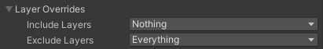

Este comportamiento es demostrado por el triángulo aguamarina.

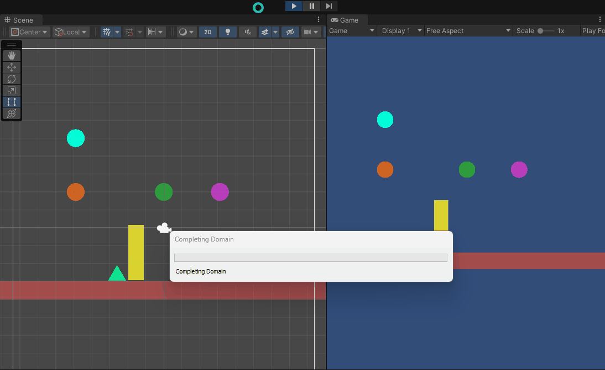

### Tilemaps

Para la parte de la práctica de tilemaps se creó el gameobject `Grid` al que se le añade un `Tilemap`. Además, se crea una paleta básica con las `tiles` ofrecidas en el paquete y se configura para poder pintar con el pincel.


Se agrega una nueva capa y se le pone el orden de dibujado a `1` para que aparezca por encima de la capa de suelo base. En este `Tilemap` se colocan elementos de decoración


Añadiendo otra capa más se añaden obstáculos en los bordes del mapa.


A este `Tilemap` se le añade el componente `Composite Collider 2D` el cual impide que el personaje camine por el obstáculo. 


Se comprueba la ejecución del videojuego.


Para que el personaje camine usando físicas se actualiza el script.

```c#
public class Walk : MonoBehaviour
{
    [SerializeField] private float speed = 3f;
    [SerializeField] private float strength = 3f;
    private Animator animator;
    private SpriteRenderer spriteRenderer;
    private Rigidbody2D rb;

    // Start is called before the first frame update
    void Start()
    {
        animator = GetComponent<Animator>();
        spriteRenderer = GetComponent<SpriteRenderer>();
        rb = GetComponent<Rigidbody2D>();
    }


    // Update is called once per frame
    void Update()
    {
        //transform.Translate(new Vector2(Input.GetAxis("Horizontal") * speed * Time.deltaTime, Input.GetAxis("Vertical") * speed * Time.deltaTime));
        HandleAnimations();
    }

    private void FixedUpdate()
    {
        rb.AddForce(new Vector2(Input.GetAxis("Horizontal") * strength, Input.GetAxis("Vertical") * strength));
    }

    void HandleAnimations()
    {
        if (Input.GetAxis("Horizontal") > 0)
        {
            SetFlags(3);
            spriteRenderer.flipX = true;
        }
        else if (Input.GetAxis("Horizontal") < 0)
        {
            spriteRenderer.flipX = false;
            SetFlags(3);
        }
        else if (Input.GetAxis("Vertical") > 0)
        {
            SetFlags(1);
        }
        else if (Input.GetAxis("Vertical") < 0)
        {
            SetFlags(2);
        }
        if (Input.GetAxis("Horizontal") == 0 && Input.GetAxis("Vertical") == 0)
        {
            SetFlags(0);
        }
    }

    /*
     * 0 -> IdleDown
     * 1 -> WalkUp
     * 2 -> WalkDown
     * 3 -> WalkRight
     */
    void SetFlags(int flag)
    {
        switch(flag)
        {
            case 0:
                animator.SetBool("IdleDown", true);
                animator.SetBool("WalkDown", false);
                animator.SetBool("WalkUp", false);
                animator.SetBool("WalkRight", false);
                break;
            case 1:
                animator.SetBool("IdleDown", false);
                animator.SetBool("WalkDown", false);
                animator.SetBool("WalkUp", true);
                animator.SetBool("WalkRight", false);
                break;
            case 2:
                animator.SetBool("IdleDown", false);
                animator.SetBool("WalkDown", true);
                animator.SetBool("WalkUp", false);
                animator.SetBool("WalkRight", false);
                break;
            case 3:
                animator.SetBool("IdleDown", false);
                animator.SetBool("WalkDown", false);
                animator.SetBool("WalkUp", false);
                animator.SetBool("WalkRight", true);
                break;
        }
    }
}

```

### Platforming

En una nueva escena se crean una serie de plataformas y se añade el personaje de otras escenas. Aparte de activar la gravedad se le añade un script que le permite moverse en la escena haciendo uso de su `RigidBody`. La versión final del script se encuentra al final de la sección.


En la segunda iteración se modifica el script para que se permita al personaje saltar. Además, se añaden elementos a las plataformas para que puedan comunicarse con el script de movimiento del personaje para saber cuando se puede mover.


Para la tercera se actualiza el script para hacer al personaje jugador hijo de la plataforma sobre la que se encuentre y deshacer el cambio cuando deja de ocuparla. De esta forma el personaje se mueve con la plataforma cuando esta lo hace.


Posteriormente se añade una plataforma con cierto layer la cual indica que el personaje jugador *no* interactúa con ella más allá de sostenerse. Por eso se añade un mensaje de consola que indica que se está pulsando la tecla para saltar, pero el personaje no ha recuperado la capacidad de saltar por tocar esa plataforma.


Se añade una plataforma la cual es invisible a la escena. Esta se encuentra en una capa la cual así lo indica. Al tocar con ella la plataforma hace visible su parte superior.


Finalmente se introduce a la escena el mismo sistema de puntos que en una práctica anterior. Además, cada punto aumenta la potencia del salto del personaje.


A continuación los scripts de esta última escena.

```c#
public class WalkPhysics : MonoBehaviour
{
    [SerializeField] private float strength = 3f;
    [SerializeField] private float jumpStrength = 3f;
    private Animator animator;
    private SpriteRenderer spriteRenderer;
    private Rigidbody2D rb;

    // Flags
    private bool jumpInput = false;
    private bool jumping = false;

    // Misc
    Transform defaultTransformParent;

    //Events
    [SerializeField] ScoreHandler scoreHandler;


    // Start is called before the first frame update
    void Start()
    {
        animator = GetComponent<Animator>();
        spriteRenderer = GetComponent<SpriteRenderer>();
        rb = GetComponent<Rigidbody2D>();
        defaultTransformParent = transform.parent;
    }

    private void OnEnable()
    {
        scoreHandler.addJumpStrength += IncreaseJump;
    }


    private void OnDisable()
    {
        scoreHandler.addJumpStrength -= IncreaseJump;
    }


    // Update is called once per frame
    void Update()
    {
        HandleAnimations();
        jumpInput = false;
        if (Input.GetKey(KeyCode.LeftShift))
        {
            jumpInput = true;
        }
    }

    private void FixedUpdate()
    {
        rb.AddForce(new Vector2(Input.GetAxis("Horizontal") * strength, 0));
        if (jumpInput && !jumping)
        {
            rb.AddForce(new Vector2(0, jumpStrength));
            jumping = true;
        }
    }

    void IncreaseJump()
    {
        jumpStrength += 50f;
    }

    void HandleAnimations()
    {
        if (Input.GetAxis("Horizontal") > 0)
        {
            SetFlags(3);
            spriteRenderer.flipX = true;
        }
        else if (Input.GetAxis("Horizontal") < 0)
        {
            spriteRenderer.flipX = false;
            SetFlags(3);
        }
        if (Input.GetAxis("Horizontal") == 0 && Input.GetAxis("Vertical") == 0)
        {
            SetFlags(0);
        }
    }

    /*
     * 0 -> IdleDown
     * 1 -> WalkUp
     * 2 -> WalkDown
     * 3 -> WalkRight
     */
    void SetFlags(int flag)
    {
        switch (flag)
        {
            case 0:
                animator.SetBool("IdleDown", true);
                animator.SetBool("WalkDown", false);
                animator.SetBool("WalkUp", false);
                animator.SetBool("WalkRight", false);
                break;
            case 1:
                animator.SetBool("IdleDown", false);
                animator.SetBool("WalkDown", false);
                animator.SetBool("WalkUp", true);
                animator.SetBool("WalkRight", false);
                break;
            case 2:
                animator.SetBool("IdleDown", false);
                animator.SetBool("WalkDown", true);
                animator.SetBool("WalkUp", false);
                animator.SetBool("WalkRight", false);
                break;
            case 3:
                animator.SetBool("IdleDown", false);
                animator.SetBool("WalkDown", false);
                animator.SetBool("WalkUp", false);
                animator.SetBool("WalkRight", true);
                break;
        }
    }

    private void OnTriggerEnter2D(Collider2D collision)
    {
        if (collision.gameObject.name == "JumpEnabler" && collision.gameObject.layer != LayerMask.NameToLayer("DodgeOtherPhysics"))
        {
            jumping = false;
            rb.velocity = new Vector2(rb.velocity.x, 0);
            transform.parent = collision.transform;
        }

        if (collision.gameObject.layer == LayerMask.NameToLayer("PlatInv"))
        {
            collision.gameObject.layer = LayerMask.NameToLayer("Default");
            collision.gameObject.GetComponentInParent<SpriteRenderer>().enabled = true;
        }
    }

    private void OnTriggerExit2D(Collider2D collision)
    {
        if (collision.gameObject.name == "JumpEnabler")
        {
            transform.parent = defaultTransformParent;
        }
    }
}

/////////////////////////////////////////////////////////////////////////

public class ScoreHandler : MonoBehaviour
{
    private List<CoinEvent> collectablesScript = new List<CoinEvent>();
    [SerializeField] private GameObject scoreGameObject;
    private TMP_Text textCanvas;
    private int score = 0;

    public delegate void AddJumpStrength();
    public event AddJumpStrength addJumpStrength;


    // Start is called before the first frame update
    void Start()
    {
        textCanvas = scoreGameObject.GetComponent<TMP_Text>();
        GameObject[] collectables = GameObject.FindGameObjectsWithTag("Collectables");
        for (int i = 0; i < collectables.Length; i++)
        {
            collectablesScript.Add(collectables[i].GetComponent<CoinEvent>());
            collectablesScript[i].collectedMessage += AddPointScore;
        }
    }

    void AddPointScore()
    {
        score++;
        textCanvas.text = score.ToString();
        addJumpStrength.Invoke();
    }
}

/////////////////////////////////////////////////////////////////////////

public class CoinEvent : MonoBehaviour
{
    public delegate void CollectedMessage();
    public event CollectedMessage collectedMessage;

    private void OnCollisionEnter2D(Collision2D collision)
    {
        if (collision.gameObject.name == "Player")
        {
            collectedMessage.Invoke();
            Destroy(gameObject);
        }
    }
}


```
